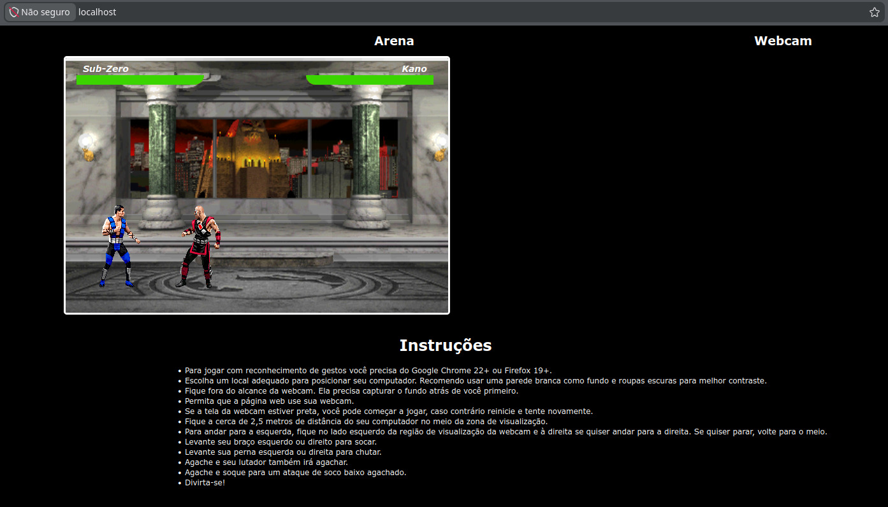
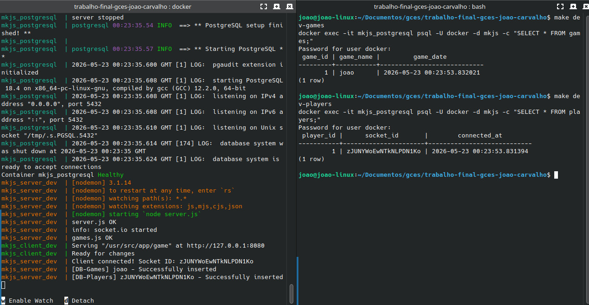

# Trabalho individual de GCES 2025-2

Os conhecimentos de Gerência de Configuração de Software são fundamentais no ciclo de vida de um produto de software. As técnicas para a gestão vão desde o controle de versão, automação de build e de configuração de ambiente, testes automatizados, isolamento do ambiente até o deploy do sistema. Todos estes itens do ciclo, nos dias de hoje, são integradas em um pipeline de DevOps com as etapas de Integração Contínua (CI) e Deploy Contínuo (CD) implementadas e automatizadas.

Para exercitar estes conhecimentos, neste trabalho, você deverá aplicar os conceitos estudados ao longo da disciplina no produto de software contido neste repositório.

A aplicação em estudo é um jogo de luta (mk.js) implementado com Backend em Node.js/Express e Frontend em HTML5 Canvas com JavaScript puro.  É um projeto interessante, mas com dependências desatualizadas que precisam ser modernizadas.

O repositório da aplicação está disponível no presente repositorio

# Etapas deste Trabalho

O trabalho deve ser elaborado em etapas. **Cada uma das etapas deve ser realizada em um commit separado** com o resultado funcional desta etapa.

Antes de iniciar as etapas, faça uma uma cópia do repositório original e copie os arquivos do projeto de base para seu repositório privado, disponibilizado dentro da Organização de GCES no Gitlab.

As etapas de 1 e 2 são relacionadas ao isolamento do ambiente utilizando a ferramenta Docker e Docker Compose. Neste sentido, o tutorial abaixo cobre os conceitos fundamentais para o uso destas tecnologias.

[Tutorial de Docker](https://github.com/FGA-GCES/Workshop-Docker-Entrega-01/tree/main/tutorial_docker)

As etapas de 3 e 4 são relacionadas à configuração do pipeline de CI e CD.

[Tutorial CI - Gitlab](https://github.com/FGA-GCES/Workshop-CI-Entrega-02/tree/main/gitlab-ci_tutorial)

## 1. Containerização da Aplicação (Em ambinete de Desenvolvimento - DEV)

A aplicação consiste em uma camada de servidor (*backend*) em Node.js com Express e Socket.io para comunicação em tempo real, e uma camada de cliente (*frontend*) em HTML5 Canvas com JavaScript puro. O jogo não utiliza banco de dados tradicional, mas mantém estado das partidas em memória no servidor. Para fins didáticos deste trabalho, será necessário integrar um banco de dados Postgres para persistir dados de jogadores e partidas.

A **Etapa 1** consiste na elaboração de um `Dockerfile` que seja capaz de criar um container para rodar cada camada da aplicação (servidor Node.js e cliente web) em modo de desenvolvimento (DEV). Neste sentido, a configuração deve ser feita com variáveis em modo dev, com debug habilitado e também com `hot reload`, ou seja, mudanças no código fonte na pasta da aplicação são imediatamente replicadas no ambiente que esteja sendo executado.

## 2. Docker Compose (Em ambinete de Desenvolvimento - DEV)

A **Etapa 2** consiste em criar o arquivo `docker-compose.yml` combinando os dois containers da aplicação criados nos arquivos Dockerfile (`cliente` e `servidor`) da Etapa 1 com o banco de dados `Postgres`.

O resultado final desta etapa consiste em poder subir a aplicação completa com o comando `docker compose up`.

## 3. Integração Contínua (CI)

Para a realização desta etapa, a aplicação já deverá ter seu ambiente completamente containerizado.

Esta etapa do trabalho deverá utilizar o ambiente de CI do Gitlab.

Requisitos da configuração da Integração Contínua (Gitlab-CI) incluem:

3.1 Build  
3.2 Teste - unitários  
3.3 Lint

Para a etapa de testes, deve ser criado um teste unitário simples para cada camada da aplicação (`cliente` e `servidor`).

Cada etapa deve ser demonstrada com o pipeline capturando erros de build, teste e lint e passando em todas as etapas. Estes estados da aplicação devem estar representados em commits sequenciais.

## 4. Containerização da Aplicação (Em ambinete de Produção - PROD)

A **Etapa 4** consiste na elaboração de um `Dockerfile` na versão para Produção baseado na imagem do Linux `Alpine`. Toda a configuração da aplicação deve ser feita em modo `produção` e sem debug. Os arquivos estáticos do `cliente` (HTML, CSS, JS) devem ser otimizados e servidos de forma eficiente, e todos os códigos fonte da aplicação devem estar autocontidos dentro dos respectivos containers do `cliente` e `servidor`.

## 5. Docker Compose (Em ambinete de Produção - PROD)

A **Etapa 5** consiste em criar o arquivo `docker-compose-prod.yml` combinando a aplicação criada nos arquivos Dockerfile criados na Etapa 4. No modo produção, os arquivos estáticos do cliente devem ser servidos através do `Nginx` que deve rodar em um container separado. O serviço do banco de dados `Postgres` segue conforme o deploy de desenvolvimento, porém, deve conter credenciais próprias de produção (usuários, senhas, etc).

O resultado final desta etapa consiste em poder subir a aplicação interia com o comando `docker compose up` exclusivamente sendo servida via SSL pela porta 443, e pela porta 80 com redirecionamento para a porta 443,  não havendo outras portas expostas para fora da rede de containers.

## 6. Deploy Contínuo (CD)

A etapa final do trabalho deverá ser realizada a partir do deploy automático da aplicação que deve ser realizado após passar sem erros em todas as etapas de CI. O deploy pode ser simulado a partir da publicação das imagens dos containers de `cliente` e `servidor` de produção no `container registry` do Gitlab.

# Avaliação

A avaliação do trabalho será feita à partir da correta implementação de cada etapa. A avaliação será feita de maneira **quantitativa** (se foi realizado a implementação + documentação), e **qualitativa** (como foi implementado, entendimento dos conceitos na prática, complexidade da solução). Para isso, faça os **commits atômicos, bem documentados, completos** a fim de facilitar o entendimento e avaliação do seu trabalho.

> **Obs: Lembramos que o trabalho é individual e cópias de soluções terão notas zeradas.**

**Observações**:
1. A data final de entrega do trabalho é o dia **13/07/2025**;
2. O trabalho deve ser desenvolvido em um **repositório PESSOAL e PRIVADO** no ambiente do `Gitlab`;
3. Cada etapa do trabalho deverá ser entregue em commits progressivos (pondendo ser mais de um commit por etapa);
4. Os **commits devem estar espaçados em dias ao longo do desenvolvimento do trabalho**. Commits feitos todos juntos na data de entrega serão descontados da nota final.

| Item | Peso |
|---|---|
| 1. Containerização da Aplicação (DEV)                         | 1.0 |
| 2. Containerização da Aplicação + Banco (DEV)         | 1.0 |
| 3. Integração Contínua (Build, Test, Lint)                    |     |
| - 3.1 Build                                                    | 1.5 |
| - 3.2 Testes                                                    | 1.5 |
| - 3.3 Lint                                                    | 1.0 |
| 4. Containerização da Aplicação (PROD)                        | 1.5 |
| 5. Containerização da Aplicação + Banco + Nginx (PROD) | 1.0 |
| 6. Deploy Contínuo                                            | 1.5 |